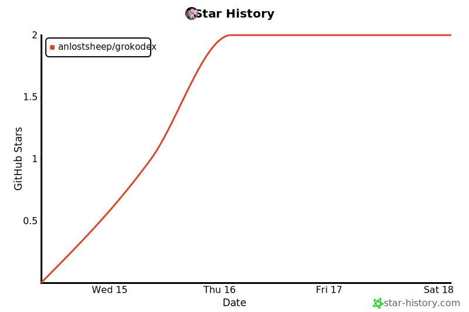

<div align="center">


# Grokodex

### 在 Codex / Claude Code 里调用本机 Grok

<p>
委托编码 · Imagine 生图 · 搜索 X<br/>
skills + MCP 插件 · 预构建 bundle · Git marketplace 一键安装
</p>

<p>
<a href="https://github.com/anlostsheep/grokodex/stargazers"></a>
<a href="https://github.com/anlostsheep/grokodex/network/members"></a>
<a href="./LICENSE"></a>
<a href="https://github.com/anlostsheep/grokodex/releases/tag/v0.2.0"></a>
<a href="https://nodejs.org/"></a>


</p>

<p>
<a href="#核心特性">核心特性</a> ·
<a href="#快速开始">快速开始</a> ·
<a href="#grok-鉴权">Grok 鉴权</a> ·
<a href="#mcp-工具">MCP 工具</a> ·
<a href="#权限说明">权限说明</a> ·
<a href="#常见问题">常见问题</a> ·
<a href="#版本与发版">版本与发版</a>
</p>

</div>

> [!NOTE]
> 本项目以 **[MIT](./LICENSE)** 开源。使用时请遵守 **xAI / Grok**、你所接的第三方上游，以及 **Codex / Claude Code** 各自的服务条款。  
> Grokodex **不替代** 本机 Grok CLI，只在宿主里通过 MCP 调用它。

**当前版本 [0.2.0](./CHANGELOG.md)** · 插件 id：`grokodex` · 仓库：[`anlostsheep/grokodex`](https://github.com/anlostsheep/grokodex)

```
Codex / Claude Code  ──skills + MCP──►  grokodex-bridge (node)
                                              │
                                              ▼
                                       本机 grok CLI
                                    （官方 / API Key / 第三方上游）
```

---

## 核心特性

| 能力 | 说明 |
| :-- | :-- |
| 双宿主插件 | **Codex** 与 **Claude Code** 同一 monorepo，Git marketplace 安装 |
| 四工具 MCP | `grok_setup` / `grok_run` / `grok_imagine` / `grok_x_search` |
| 四套 skills | 引导何时调工具；默认 **受限权限**（`restricted`） |
| 预构建 bundle | 提交 `plugins/grokodex/bridge/dist/bundle.mjs`，用户 **无需** `npm install` |
| 鉴权灵活 | 官方 `grok login`、**或** `XAI_API_KEY`、**或** 第三方/自建 OpenAI 兼容上游 |
| Leader 暖进程 | 默认开启，加速 headless；可关 |
| 会话续作 | 可选 `host_thread_id`，多轮 `grok_run` 接同一 Grok 对话 |
| Claude 路径正确 | ≥0.2.0 使用 `${CLAUDE_PLUGIN_ROOT}`，避免相对路径指到会话工作区 |

---

## 快速开始

### 1. 前置依赖

| 依赖 | 说明 |
| :-- | :-- |
| **Node.js ≥ 18.18** | 必须在 **PATH**（公开安装用命令名 `node`） |
| **Grok CLI** | [安装脚本](https://x.ai/cli) / `grok` 在 PATH，或设 `GROK_PATH` |
| **可用上游鉴权** | 见 [Grok 鉴权](#grok-鉴权)（**不强制** 只做 OAuth） |
| **Codex 和/或 Claude Code** | 支持 plugin marketplace 的本机版本 |

```bash
# macOS / Linux / WSL — 仅安装 CLI
curl -fsSL https://x.ai/cli/install.sh | bash

# Windows PowerShell
irm https://x.ai/cli/install.ps1 | iex
```

### 2. 安装插件（Git marketplace）

**Codex**

```bash
codex plugin marketplace add anlostsheep/grokodex
codex plugin add grokodex@grokodex
# 钉版本示例：
# codex plugin marketplace add anlostsheep/grokodex --ref v0.2.0
```

完全退出并重启 Codex App → 确认插件已启用 → 新会话。

**Claude Code**

```bash
claude plugin marketplace add anlostsheep/grokodex
claude plugin install grokodex@grokodex
```

重启 / 新会话 → `/mcp` 或 `/plugins` 确认 **插件内** MCP `connected`。

> [!TIP]
> 若提示 *MCP skipped – same command/URL as already-configured "grokodex"*：说明还有**另一条**手写/项目 `.mcp.json` 或旧 MCP 与插件抢名字。关掉或删除重复的 `grokodex` MCP，只留插件那条，再新开会话。

### 升级 Codex 插件

Codex **没有**单独的 `plugin upgrade`。要升版：先刷新 **marketplace 快照**，再 **重装插件**，最后重启 App。

Marketplace 的配置名是 **`grokodex`**（不是 `anlostsheep/grokodex`）。`marketplace remove` 只接受名字（字母、数字、`_`、`-`），带 `/` 会报 invalid name。

**A. 跟 main 安装的（未使用 `--ref`）**

```bash
codex plugin marketplace upgrade grokodex
codex plugin remove grokodex@grokodex
codex plugin add grokodex@grokodex
```

完全退出并重启 Codex App → 新会话。

**B. 钉 tag 安装的（例如 `--ref v0.2.0`）**

`marketplace upgrade` 只会按**已登记的 ref** 刷新，不会自动跳到新 tag。换版本需先卸 marketplace，再钉新 tag：

```bash
codex plugin remove grokodex@grokodex
codex plugin marketplace remove grokodex

codex plugin marketplace add anlostsheep/grokodex --ref v0.3.0   # 换成目标 tag
codex plugin add grokodex@grokodex
```

重启 Codex App → 新会话。

**C. 本地开发（personal marketplace）**

若用过 `./scripts/install-codex-plugin.sh`（`grokodex@personal`），在仓库更新后重新跑该脚本即可，与公开 Git 的 `grokodex@grokodex` 互不自动同步。

**可选核对**

```bash
codex plugin marketplace list
codex plugin list --marketplace grokodex
# 快照内版本（package / plugin 清单）
# cat ~/.codex/.tmp/marketplaces/grokodex/package.json | head -5
```

> [!IMPORTANT]
> 只 `plugin remove` **不会**换掉 marketplace 源。若提示 *marketplace 'grokodex' is already added from a different source*，先执行 `codex plugin marketplace remove grokodex`，再 `add`（需要时可加 `--ref`）。

### 3. 第一次调用

1. 终端确认 Grok 可用：`grok whoami` 或 `grok -m <模型> -p "ping"`  
2. 宿主里调用 **`grok_setup`**  
3. 再 **`grok_run`**（例如 prompt：`Reply with exactly: pong`）  
4. 生图 → `grok_imagine`；搜 X → `grok_x_search`  

**业务任务请走 MCP**，不要用 shell 旁路 `grok`（装 CLI / 改 `~/.grok/config.toml` / 登录除外）。

### 4. 本地开发安装（可选）

改本仓库代码时：

```bash
./scripts/install-codex-plugin.sh    # → personal marketplace
./scripts/install-claude-plugin.sh   # → grokodex-local
# 可选：--no-build / --no-leader
```

---

## Grok 鉴权

Grokodex 只调本机 **Grok Build CLI**。上游怎么连，由 **Grok 自己的配置**决定——**不必**只能 `grok login`。

| 方式 | 适用 | 做法 |
| :-- | :-- | :-- |
| **A. 官方 session** | xAI 订阅 / 官方账号 | `grok login` → `~/.grok/auth.json` |
| **B. 官方 API Key** | 控制台 Key | `export XAI_API_KEY=...`（旧名 `GROK_CODE_XAI_API_KEY` 常仍可用） |
| **C. 第三方 / 自建** | OpenAI 兼容中转、Sub2API 等 | `~/.grok/config.toml` 写 `[model.*]`，或 `GROK_MODELS_BASE_URL` + key |

**C 示例（推荐按模型分段）：**

```toml
# ~/.grok/config.toml

[model.my-upstream]
model = "grok-4.5"
base_url = "https://api.example.com/v1"
name = "My Upstream Grok"
env_key = "MY_UPSTREAM_API_KEY"
api_backend = "responses"   # chat_completions | responses | messages
context_window = 128000

# [models]
# default = "my-upstream"
```

```bash
export MY_UPSTREAM_API_KEY="sk-..."
grok models
grok -m my-upstream -p "ping"
```

> [!IMPORTANT]
> - 自定义模型配了 `api_key` / `env_key` 后，**该模型用 key**，不会拿官方 session 打第三方。  
> - Key **不要**提交 git；优先 `env_key`。  
> - 完整第三方上游说明：[Grok Build 接入第三方 API](https://blog.silascoding.com/ai/grok/third-party-api)（以本机 `~/.grok/docs` 为准）。

---

## MCP 工具

| 工具 | 作用 | 说明 |
| :-- | :-- | :-- |
| `grok_setup` | 诊断本机 grok | 路径 / 版本 / 鉴权探测；建议先调。`auth file present` **≠** session 一定有效 |
| `grok_run` | 通用 headless 委托 | 默认 **受限**（`restricted`）；可显式 `inherit`；可传 `model` |
| `grok_imagine` | Imagine 生图 | 窄权限；产物默认 `.grokodex/images` |
| `grok_x_search` | X / Twitter 搜索 | 只读；`semantic` / `keyword` |

统一 JSON：`ok` + 失败时 `error.code` / `hint`。Claude 界面可能显示 `mcp__…__grok_run`，逻辑名仍是上表。

### `grok_run` 常用参数

| 参数 | 说明 |
| :-- | :-- |
| `prompt` | **必填**，任务描述 |
| `cwd` | 工作目录（默认宿主工作区） |
| `permission_mode` | `restricted`（默认）或 `inherit`（继承宿主，需用户明确要求） |
| `host_sandbox` | 仅 `inherit`：`read-only` / `workspace-write` / `danger-full-access` |
| `host_thread_id` | 宿主线程 id，用于多轮续聊（如 `codex:<id>` / `claude:<id>`） |
| `fresh` | `true` 强制新 Grok 会话 |
| `session_id` | 高级：显式 Grok 会话 id |
| `model` / `max_turns` / `timeout_ms` / `extra_rules` | 可选 |

`codex_sandbox` 是 `host_sandbox` 的旧别名；两字段冲突 → `INVALID_ARGS`。

---

## 权限说明

| 档位 | 白话 | 何时用 |
| :-- | :-- | :-- |
| **`restricted`（默认）** | 可在当前项目读写；高危 shell **拒绝**；不自动 always-approve | **日常默认**；不传参数即此档 |
| **`inherit`** | 尽量跟当前宿主会话同权 | 仅用户明确说「同权 / Full Access」；**禁止**因任务难自动抬权 |

`inherit` 时必须能解析 **`host_sandbox`**（参数 → 环境变量 → 可选读 Codex 配置），否则 `INHERIT_UNAVAILABLE`，**不会**静默 full。

| `host_sandbox` | 含义 |
| :-- | :-- |
| `read-only` | 只读 |
| `workspace-write` | 工作区可写（接近默认 restricted） |
| `danger-full-access` | 高危全开；费用与风险高，仅明确要求时用 |

`grok_imagine` / `grok_x_search` **永不**完整 shell inherit。

---

## Leader 与会话续作

| 概念 | 白话 | 默认 |
| :-- | :-- | :-- |
| **Leader** | 本机 Grok 暖进程，少冷启动 | 开（`GROKODEX_USE_LEADER=1`） |
| **one-shot** | 每次单独起 `grok` | `GROKODEX_USE_LEADER=0` 或 install `--no-leader` |
| **会话续作** | 多轮 `grok_run` 接同一 Grok 对话（`--resume`） | 开；传 `host_thread_id` |

**Leader ≠ 会话续作**（进程是否暖 vs 聊的是否同一条 thread）。

| 环境变量 | 默认 | 含义 |
| :-- | :-- | :-- |
| `GROKODEX_USE_LEADER` | true | 是否用 leader |
| `GROKODEX_LEADER_FALLBACK` | true | leader 失败是否 one-shot |
| `GROKODEX_LEADER_ENSURE` | true | 是否尝试拉起 leader |
| `GROKODEX_SESSION_REUSE` | true | 是否按 host map resume |
| `GROKODEX_SESSION_RESUME_FALLBACK` | true | resume 失败是否去掉 resume 重试 |

Codex 建议 `host_thread_id=codex:$CODEX_THREAD_ID`；Claude 建议 `claude:$CLAUDE_CODE_SESSION_ID`。

---

## 环境变量（摘要）

**Grok CLI / 上游（非 Grokodex 独有）**

| 变量 | 说明 |
| :-- | :-- |
| `GROK_PATH` | grok 二进制路径 |
| `XAI_API_KEY` | 官方或网关 API Key |
| `GROK_MODELS_BASE_URL` | 全局 OpenAI 兼容 base（含 `/v1`） |
| `GROK_MODELS_LIST_URL` | 可选，模型列表 URL |

**Grokodex bridge**

| 变量 | 说明 |
| :-- | :-- |
| `GROKODEX_DEFAULT_PERMISSION` | 默认权限档（默认 `restricted`） |
| `GROKODEX_ALLOW_INHERIT` | 是否允许 inherit |
| `GROKODEX_HOST_SANDBOX` | inherit 时宿主能力档 |
| `GROKODEX_X_SEARCH_TIMEOUT_MS` | 默认 `90000` |
| `GROKODEX_IMAGINE_TIMEOUT_MS` | 默认 `120000` |

---

## 仓库结构

```text
plugins/grokodex/          # 公开可安装单元（提交 git）
  .mcp.json                # Claude：CLAUDE_PLUGIN_ROOT
  .mcp.codex.json          # Codex：相对路径
  bridge/dist/bundle.mjs
  skills/ assets/
.agents/plugins/           # Codex marketplace 清单
.claude-plugin/            # Claude marketplace 清单
bridge/ skills/ hosts/     # 开发源
scripts/                   # package / install / release
```

---

## 版本与发版

| 项 | 约定 |
| :-- | :-- |
| 唯一版本源 | `package.json` → `"version"` |
| 同步 | `npm run package:plugin` 写入插件与 marketplace |
| Tag | `v0.2.0` 等形式，可 `marketplace add --ref` |
| 使用者升版 | 见 [升级 Codex 插件](#升级-codex-插件)（`upgrade` 或换 tag） |
| 变更 | [`CHANGELOG.md`](./CHANGELOG.md) |

```bash
# 日常改代码（不升版本）
npm test && npm run package:plugin && npm run check:plugin

# 正式发版（工作区干净）
./scripts/release.sh patch|minor|major [--push]
# 或：./scripts/release.sh 0.2.1 --push
```

---

## 常见问题

| 问题 | 处理 |
| :-- | :-- |
| 插件装了但超时 / MCP `-32000` | 先查本机 Grok：`grok whoami` 或 `grok -m … -p "ping"`，不是先重装插件 |
| 日志 `User unauthorized` + 无限 Reconnecting | 官方 session 失效；`grok login` 后**重启宿主**。有 `relay_connected` 多半**不是代理**问题 |
| `Device not configured` | 登录态/设备未就绪；官方路径重新 login；无 TTY 的 shell 里 `whoami` 可能误导 |
| `grok_setup` 显示 auth 有文件但仍失败 | 目前 mainly 看 `auth.json` 是否存在；**不能**证明 token 仍被官方接受 |
| Claude 起不来 / 找不到 `bundle.mjs` | 需 **≥0.2.0**（`${CLAUDE_PLUGIN_ROOT}`）。旧版相对路径会被解析成**会话工作区** |
| MCP skipped / 两个 grokodex | 关掉手写或项目 `.mcp.json` 里的同名 MCP，只留插件 MCP |
| 只要第三方上游仍超时 | 修好 `config.toml` 后，坏官方 session + 默认 leader 仍可能连 `code.grok.com`；`GROKODEX_USE_LEADER=0` 或修好 login |
| 改了源码宿主没变 | 源码目录 ≠ 已装插件；需 `package:plugin` 提交或跑 install 脚本 |
| Codex 升不了版 / *different source* | `marketplace remove` 用名字 **`grokodex`**，不是 `anlostsheep/grokodex`；步骤见 [升级 Codex 插件](#升级-codex-插件) |

更细的术语表（`restricted` / `inherit` / leader 等）见下方折叠。

<details>
<summary><strong>术语速查</strong></summary>

| 术语 | 含义 |
| :-- | :-- |
| 宿主 | Codex / Claude Code 等客户端 |
| bridge | 本插件 MCP 实现，转调 `grok` |
| marketplace | 插件目录；本仓是 Git marketplace，非官方默认商店 |
| MCP | 宿主调用外部工具的协议；本插件为本地 stdio |
| restricted | 默认受限权限 |
| inherit | 继承宿主权限（需用户明确 + `host_sandbox`） |
| Leader | Grok 暖进程 |
| one-shot | 不用 leader，单次拉起 |
| host_thread_id | 宿主线程 id，用于会话续作 |
| CLAUDE_PLUGIN_ROOT | Claude 注入的插件根路径变量 |

</details>

---

## 限制（非目标）

- 不把宿主默认模型换成 Grok  
- 无本机 **Grok CLI + 可用上游** 则无法工作（含多数 Cloud agent）  
- 不在 Grokodex 内代管第三方 key  
- 不做完整 Grok TUI / ACP 嵌套 UI  
- 不进 OpenAI / Anthropic **官方默认插件商店**（仅 Git marketplace）  
- 不静默自动提权  

---

## 贡献与支持

- Issue / PR：<https://github.com/anlostsheep/grokodex/issues>  
- 反馈时请尽量附：`grok --version`、`grok whoami` 摘要（**不要**贴 `auth.json` / key）、是否第三方上游、是否 `User unauthorized`、宿主类型  

---

## Star History

如果这个项目对你有帮助，欢迎点 **Star**。

<!-- star-history:start -->
<picture>
  <source media="(prefers-color-scheme: dark)" srcset="assets/star-history/star-history-dark.svg">
  
</picture>
<!-- star-history:end -->

<p align="center">
  <a href="https://www.star-history.com/?type=date&repos=anlostsheep%2Fgrokodex">star-history.com</a>
  ·
  <a href="https://github.com/anlostsheep/grokodex/stargazers">Stargazers</a>
</p>

---

<div align="center">

**[MIT License](./LICENSE)** · Copyright (c) 2026 Grokodex contributors

</div>
